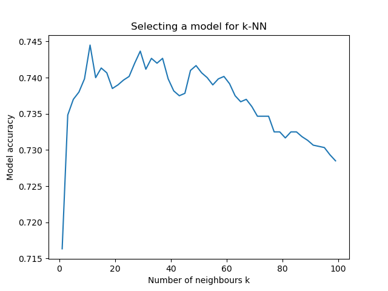
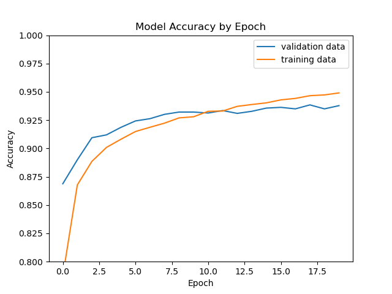
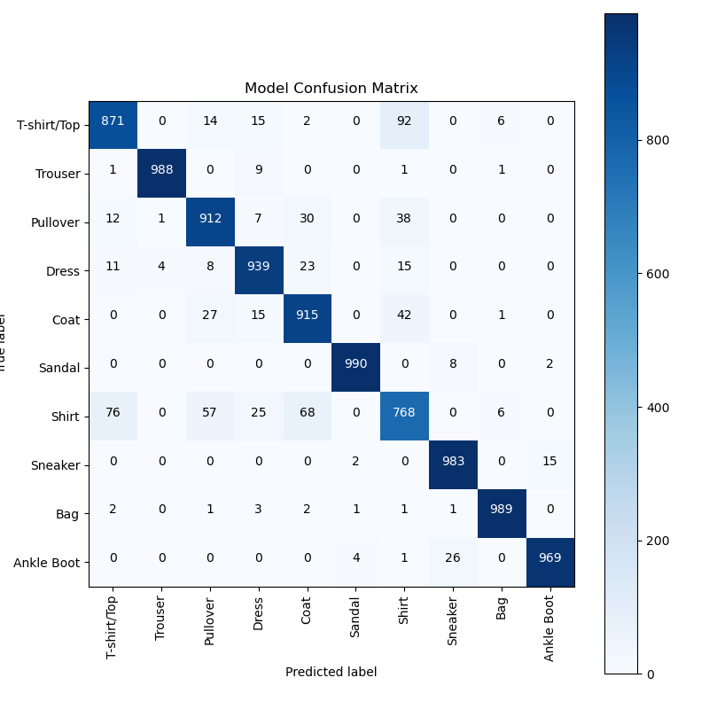

# Fashion-mnist data classifying
## Introduction
The Fashion-MNIST Data Set is for use in benchmarking machine learning algorithms in image analysis. It contains 70,000 28x28 pixel grayscale images of fashion articles divided in 10 categories. The training set contains 60,000 images (6000 from each category) and the test set 10,000 images (1000 from each category). A sample from the data set is visualized in the image below:

When working with this data set, the feature variables will be the grayscale values for each of the 784 pixels in a given image, loaded either as a 784x1 vector or as a 28x28 array. The target variable is a number from 0 to 9, representing the category of the each item.

The problem that is solved by this program is to classify images in the test set into their true categories as accurate as possible, based on what the model learned from the training set.
## Methods
In this project, there are two models applied to the fashion-mnist data.

### KNN algorithm

Firstly, the program contains K-Nearest-Neighbour algorithm, which I prepared for the previous class on my university.
In the process of selecting the model, I used the hamming distance to measure the distance between two images, and all of the neighbours are equally weighted. The selection process takes the best value for parameter k from the range 1 to 100 with the step of 2.
It takes 54000 images from the training set for the train data and 6000 images for the validation data, which it uses to choose the best value of the k parameter of the model.

Then it is tested on 10000 images from the test data set to get the accuracy of the model.

Source of this model implementation is on page: [KNeighbours algorithm](https://www.ii.pwr.edu.pl/~zieba/zad2_msid.pdf)

### CNN model

The second model, which is meant to output the best accuracy on the test data as possible is a convolutional neural network.

Before building a model, at the begining, the data set is preprocessed. The images are reshaped into 24x24 arrays, instead of 784 one-dimensional arrays. Then, the values of every pixel are converted to floats and scaled to the range 0 to 1. 
The categories, which originally are marked with an integer number 0-9, are converted to categorical arrays, which means that for example category number 3 is converted to array [0, 0, 0, 1, 0, 0, 0, 0, 0, 0].

The model is build with the Sequential model from Keras library. There are multiple layers added to the model to achieve the best results. We have to sets of layers, where two first layers of the set are convolutional layers. They are responsible for applying numerical filters on each of images.

Then, after two convolutional layers, there is one pooling layer. It is responsible for pooling groups of pixels into a one, single value.

The last layer in the set is a dropout layer. It is responsible for regularizing the model and it reduces overfitting, by dropping out a part of neurons randomly.

After Two sets of layers described above, there is one flatten layer, which transforms a two-dimensional matrix of features into a vector.

Next, there is a single dense layer, which is just a regular layer of neurons.

After all of that, there is one more dropout layer and final, single dense layer made of 10 neurons.

Then it is trained with the 54000 images from the train data set and validated with the remaining 6000 images from the train data set for 20 epochs. Finally, the trained model is evaluated on the 10000 test data set, which gives us the final accuracy value of the model

Sources of inspiration and information for building cnn model:

[Keras API](https://keras.io/api/)

[Building a convolutional neural network](https://towardsdatascience.com/building-a-convolutional-neural-network-cnn-in-keras-329fbbadc5f5)

[Guide to convolutional neural networks](https://www.superdatascience.com/blogs/the-ultimate-guide-to-convolutional-neural-networks-cnn)

## Results
### KNN model
Training and testing process on my computer took about 45 minutes. All the results of training and testing are saved to files: /plots/knn_accuracy.png, results/knn_train_results.txt and results/knn_test_results.txt.

After selecting the best knn model, it turns out that the best k is **11**, with the accuracy: **0.7455**

When the model with that k is tested on the test data, we get the accuracy of the model: **0.7321**

It is significantly less than the accuracy presented in the benchmark table:

| Name | Accuracy |
|------|----------|
| **MyKNN** | **0.7321** |
| KNeighborsClassifier | 0.86 |

There could be a few explanations for this difference in the results, but I think that the main two are: the difference in measuring the distance between two sets of images - my algorithm uses hamming distance, while the KNeighboursClassifier uses manhattan distance, the second one is that the algorithm from scikit-learn library weights all neighbours with thier distance to each other.

Of course the biggest difference in these algorithms is that the scikit-learn one is far more and better optimized and written than mine.

### CNN model
Training process on my computer for 20 epochs took about 35 minutes. All the results of training and testing are saved to files: /plots/model_accuracy.png, /plots/model_mistakes.png, results/model_train_results.txt and results/model_test_results.txt.

After selecting training cnn model, it turns out that the best model was in epoch **15**, with the validation accuracy: **0.9386**

Considering that test and validation accuracy are relatively close to each other, we can assume, that the model is not greatly under or overfitted, but we can also see that after epoch number 10 the model started to slightly overfit.

When the best model is tested on the test data, we get the accuracy of the model: **0.9324**

It is far more than the accuracy of the best algorithm from scikit-learn library:

| Name | Accuracy |
|------|----------|
| **MyCNN** | **0.9324** |
| SVC | 0.897 |
| 2 Conv <100K parameters | 0.925 |
| 2 Conv+pooling+BN	| 0.934 |
| GoogleNet with cross-entropy loss | 0.939 |
| CNN with optional shortcuts, dense-like connectivity | 0.947 |

Compared to the other deep learning algorithms submitted by users, my model do quite well. Escpecially compared to other convolutional neural networks without augmentation, my algorithm works very well.

What is the most difficult piece of clothing to the model to classify?

After training and testing the model, I also wanted to visualize where the model makes mistakes - a confusion matrix:

We can see how many images in each class have been predicted to their correct class and to other classes. It is clear that there are certain categories which are more difficult for the model than other. The categories: T-shirt, Shirt, Coat, Dress, Pullover - they all look very similiar and they are the cause of the majority of errors. Also Sneakers, Sandals and Ankle Boot are sometimes wrongly predicted.

## Usage
The fashion-mnist data for the project is downloaded automatically.
To run the project it is required to use Python 3.6 interpreter or newer, with following libraries installed:
1. numpy
2. matplotlib
3. scikit-learn
4. tensorflow
5. keras

You also have to install all of these libraries dependencies.

To train and test models presented in the results section, you have to run the main.py file from this repository.

If you want to get exactly the same results as in the section above, you have to skip the training process comment line 144 in knn.py and 39 in cnn.py - they are responsible for training the new models, if they're commented, the models will be loaded from files in the repository. The KNN model will load the best k value from file /models/best_knn_model.txt and the CNN model will be loaded from file /models/best_model.h5.

All the results of the program are saved to directories /plots - plots from training models, /models - saving best models for later use, /results - accuracy results of training and testing.
